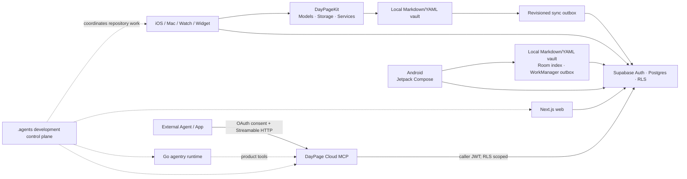

# Current architecture

DayPage is a local-first memory system with Apple, Android, web, integration, and
agent-runtime surfaces in one repository.

## Apple surfaces

`DayPage.xcodeproj` contains iOS, macOS, watchOS, widget, and test targets. The iOS app
uses SwiftUI with sidebar navigation and an implemented Graph surface. App targets own UI,
platform frameworks, secrets adapters, and SDK boundaries.

`DayPageKit` is a Swift package with:

- `DayPageModels`: shared value types and serialization contracts.
- `DayPageStorage`: vault access, mutation, conflict, logging, and storage adapters.
- `DayPageServices`: shared compilation, retrieval, feature, and domain services.

The Kit supports iOS 16, macOS 13, and watchOS 10. App-specific Supabase/Sentry behavior
stays at adapter boundaries instead of forcing those SDKs into the shared package.
Operational auth/sync telemetry crosses that boundary through an allow-listed event
contract; durable device diagnostics contain codes and timing metadata, never Vault
content or account addresses. See
[ADR-0013](decisions/ADR-0013-privacy-safe-operational-diagnostics.md).

## Data and compilation

Raw memos are stored as YAML-front-matter Markdown in
`vault/raw/YYYY-MM-DD.md`, with attachments under `vault/raw/assets/`. Compiled Daily
Pages and knowledge artifacts live under `vault/wiki/`.

The conceptual flow is raw capture -> vault mutation -> AI compilation -> Daily Page ->
entity updates -> graph/retrieval. Storage mutations must serialize concurrent writes;
retryable compilation/entity operations must remain idempotent. Format or migration
changes require compatibility tests, rollback, and an ADR.

Entity persistence treats the raw-input `source_hash` as a compilation operation ID.
Instructions for one resolved entity page are committed atomically with an ignored
Markdown HTML marker, and the entity index is reconciled idempotently on retry. The Daily
Page completion marker is written only after those throwable entity operations succeed.
See [ADR-0007](decisions/ADR-0007-compilation-entity-operation-markers.md).

## Web and integrations

`android/` is a Kotlin / Jetpack Compose application. Its canonical records use the
same `vault/raw/YYYY-MM-DD.md` format as Apple clients; Room is a query index and durable
sync outbox, not a replacement source of truth. Android uses Supabase Auth PKCE, Android
Keystore-protected session envelopes, monotonic pull cursors, exact push receipts, and
WorkManager retry. Pulled pages reach the raw Vault before their cursor commits. See
[ADR-0009](decisions/ADR-0009-native-surfaces-shared-contracts.md).

`web/` is a Next.js 16 / React 19 application in the pnpm workspace. It owns web UI,
server routes, auth, connectors, database access, background jobs, and browser tests.

`packages/mcp-server/` is a TypeScript MCP server for DayPage operations. It shares the
workspace but has its own build, type-check, and Node test gates.

Raw Vault writes are acknowledged locally before network work. A versioned operational
outbox records upserts and tombstones, and Supabase applies them idempotently under RLS.
External agents use the OAuth-protected Streamable HTTP MCP endpoint; the MCP process uses
the caller's Supabase token rather than a broad database credential. See
[ADR-0008](decisions/ADR-0008-local-first-sync-and-cloud-mcp.md).

## Agent boundaries

`agentry/` is a Go product runtime exposing its own provider/tool/session/transport seams.
It can be integrated into DayPage features, but it does not coordinate repository work.

`.agents/` is the repository development control plane. It defines roles, workflows,
handoffs, and evidence without taking a runtime dependency on `agentry`. Host adapters in
`.codex/` and `.claude/` remain thin.

## Trust boundaries

- User vault content and credentials are private and never development context by default.
- Local verification uses isolated fixtures/containers and must prove restoration.
- Remote services, production databases, releases, and GitHub writes require explicit
  action-specific authorization.
- Historical documents provide evidence but do not override current indexed docs, code,
  tests, or accepted decisions.
