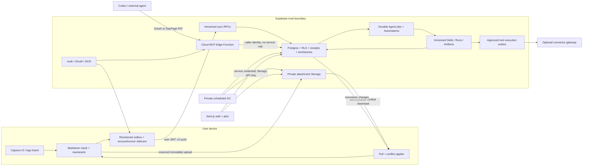

# DayPage backend system

This document is the current operating blueprint for DayPage's backend. It separates
implemented behavior from proposed work and production operations. Accepted decisions
remain authoritative when details conflict.

## Capability status

| Capability | Current state | Evidence / owner |
| --- | --- | --- |
| Email/Apple identity and session-backed native sync | Implemented | ADR-0008, `AuthService`, native live tests |
| Local-first memo create/edit/delete | Implemented | Vault + revisioned outbox + sync RPC |
| Multi-device incremental pull and conflicts | Implemented | server sequence cursor, two-Vault live test |
| Tenant isolation and operation idempotency | Implemented | RLS migrations and transactional negative verifier |
| External agent access | Implemented | OAuth/PAT, Streamable HTTP MCP, SDK acceptance |
| Local backend from an empty database | Implemented | pinned CLI, Edge bundle, Supabase + Drizzle migrations |
| Photo/audio/PDF byte sync | Implemented locally; staging pending | ADR-0016, v2 RPCs, two-Vault + TUS live tests |
| Delayed attachment deletion | Implemented locally; scheduler not deployed | 30-day queue + leased private Storage-API worker |
| Apple system action replica and MCP proposal boundary | Implemented locally; native rollout pending | ADR-0017, migration 0030, transactional two-tenant verifier |
| Backend-first Agent data plane | Implemented locally; shadow is the safe default | ADR-0018, migration 0031, transactional verifier |
| Native derived-artifact convergence | Implemented behind default-off flag | session-backed RPC/read client + `_agent/cache` |
| External tool execution | Fail-closed gateway contract; connectors not configured by default | approval + scoped connection + leased outbox + receipt |
| Guaranteed iOS background execution | Not promised | foreground/process-lifetime sync by ADR-0008 |
| Production migration/deployment | Not authorized | staging evidence exists; production remains unchanged |

## Runtime topology



The Vault is the capture source of truth. Postgres is the authenticated cross-device
replica, query boundary, web data store, and agent-facing read/write surface. It does not
replace the local capture commit.

## Apple system action boundary

ADR-0017 adds a separate proposal/decision/receipt protocol without changing memo
Markdown or attachment persistence. The device ledger under DayPage-owned operational
metadata is authoritative for local durability; Apple Framework stores are authoritative
for the actual external effect. Postgres coordinates cross-device visibility and leases
but never represents an OS permission or a successful Apple write without an immutable
device receipt.

Migration `0030_system_actions.sql` owns six relations with RPC-only mutation: proposals,
approvals, receipts, capability policies, fingerprint-bound idempotency state, and short execution leases.
The four durable replicated objects share an independent monotonic change sequence.
Authenticated clients may select their own durable rows, but have no direct insert,
update, delete, or truncate permission. Sync receipts and leases are never directly
selectable. The migration also removes all direct access to the older `sync_operations`
table while preserving both existing versioned sync RPCs as tenant-bound
security-definer functions.
Cloud proposal/approval apply and claim each lock and recheck every payload-required
capability policy. The policy must be active, offered, synchronized, nondeleted, and
`full_proposal`; payloads with no required cloud capability remain local-only. A receipt
for an exact lease that was already issued while eligible remains admissible after a
policy downgrade, solely to publish terminal evidence and release that lease. Revocation
cannot issue a new claim or authorize a different tuple.
The native client likewise chooses an online lease only with a live authenticated
session, available network, and a fully cloud-eligible proposal. Signed-out, private-only,
redacted, deleted-policy, and partially eligible proposals execute through the durable
device-owner path and do not attempt a remote claim.

The versioned public RPCs are:

- `daypage_apply_system_action_operations_v1(jsonb)` for exact, fingerprint-bound
  proposal/approval/receipt/policy apply. Policy revisions are replicated in order; when
  full sync is enabled, the native outbox backfills the proposal-revision, decision, and
  receipt causal chain before later policy-dependent records;
- `daypage_pull_system_action_changes_v1(bigint, integer)` for ordered, paginated
  changes and tombstones;
- `daypage_claim_system_action_execution_v1(...)` for approval-bound execute/undo
  leases, exact retry, concurrent exclusion, fail-closed expired-attempt recovery, and
  historical-success detection. The server-issued lease timestamp is the receipt start;
  local clock skew is not trusted. Proposal revision/provenance cannot change after any
  execution lease or receipt exists, and undo is bound to the successful executor device.
- Approval records expose `has_replacement` on the wire. Postgres derives the internal
  same-proposal replacement foreign key and compares expiry to server `now()`, so a fast
  client clock cannot invalidate an otherwise current approval.
- `daypage_mcp_propose_system_action_v1(uuid, jsonb)` for an OAuth-client proposal
  after rechecking its independent grant. OAuth credentials are rejected by native
  apply, pull, claim, approval, and receipt paths.

Cloud MCP can only propose and read through `daypage_propose_action`,
`daypage_list_action_proposals`, and `daypage_list_action_receipts`. Independent
`can_read_actions` and `can_propose_actions` OAuth grants default off; PATs require
`actions:read` and `actions:propose`. Memo `read`/`write` never implies action access.
The historical PAT `admin` scope keeps only its legacy memo compatibility and likewise
does not imply either action scope; action authority must always be granted explicitly.
OAuth credentials cannot directly select the action tables: read tools use bounded
proposal and receipt projection RPCs that exclude device and lease identifiers. Neither
authentication path uses a service-role client, and no MCP tool can approve, execute,
undo, request permission, or receive a raw Apple identifier. MCP-created proposals
always use the `any` target because a cloud client has no native creator device identity.
They are also fixed to `private` redaction before native approval; MCP input cannot
widen that disclosure level.
OAuth and PAT list projections share the same bounded fields and canonical UTC
millisecond timestamp wire format; database-native `+00:00` timestamp rendering is
never exposed as an alternate protocol representation.
First-party settings call dedicated grant RPCs. Reconnect always resets both action
flags to false, and revoke clears memo and action access together, so an old OAuth
grant cannot silently restore action authority.

The native outbox removes an envelope only after an exact acknowledgement. A validated
terminal rejection quarantines that exact immutable envelope (tracked by fingerprint)
so it cannot block unrelated later work or be regenerated during backfill; it does not
erase the local proposal, decision, or receipt. A native Apple success remains a UI
success when receipt publication is temporarily unavailable, with pending sync shown
separately.

## Native write transaction

1. `RawStorage` atomically commits `vault/raw/YYYY-MM-DD.md` in the existing format.
2. The same mutation records an operation under `vault/_agent/sync/outbox-v1.json`.
3. UI success means local durability; network state is reported separately.
4. After session restoration, `SupabaseSyncUploader` sends the operation with the user's
   publishable key and access token.
5. For attachments, the client streams SHA-256/size from a safe `raw/assets/**` path,
   reserves the exact tenant/memo/content key, uploads without overwrite (TUS above
   6 MiB), and verifies any pre-existing object rather than trusting it.
6. `daypage_apply_sync_operations_v2` derives the tenant from `auth.uid()`, atomically
   commits the memo + ordered manifest + receipt, and binds the receipt to protocol,
   operation, memo, kind, revision, memo hash, and manifest hash.
7. The client removes only the exact acknowledged outbox operation. A timeout or lost
   response retries the same operation safely.

Cloud sync is provider-encrypted, not end-to-end encrypted. Markdown never contains an
account ID, object key, upload URL, credential, or transfer status.

## Pull, conflicts, and account safety

- Each user-visible memo mutation receives a server-owned `sync_change_sequence`.
- A device pulls changes strictly after its durable integer cursor.
- Before the memo cursor advances, each remote media obligation is persisted in the
  atomic transfer sidecar. Downloads are staged, streamed through SHA-256/size
  verification, and atomically installed under `raw/assets/`.
- Remote application bypasses outbound recording so a pull cannot echo into another
  push.
- A newer remote revision wins its UUID. If a local unsynced edit conflicts, DayPage
  preserves the local text under a new UUID instead of discarding it.
- A terminally rejected same-revision system-action proposal, capability policy, or
  one-decision-per-phase replacement records its exact stable key. Pull adopts the
  authenticated server winner for only that key and advances the action cursor;
  unrelated same-revision differences still fail closed.
- A Vault binds to the first authenticated account that enables sync. Another account
  fails closed rather than uploading the old Vault under a new tenant.
- Explicit sign-out closes the system-action coordinator while the old account token is
  still valid, then refuses identity revocation/ledger erasure until any online claim or
  lease has exact remotely confirmed terminal evidence.
- Tombstones converge deletion across devices without making wall clocks authoritative.

## Agent and integration path

The canonical MCP resource is the Supabase Edge function built from
`packages/mcp-server` with the official MCP SDK.

Interactive clients use Supabase OAuth 2.1/OIDC, PKCE, consent, and dynamic client
registration. The custom access-token hook adds the canonical MCP resource audience only
to OAuth-client sessions. DayPage read/write permission is separately rechecked from
`mcp_client_grants` on every request.

Non-interactive clients use a revocable DayPage PAT. Only its SHA-256 hash is stored.
The fixed `SECURITY DEFINER` RPC resolves owner and scopes internally; it never accepts a
caller-supplied user ID and exposes no underlying key table to the anonymous role.

Neither path puts a service-role key or `DATABASE_URL` in the request handler. MCP logs
exclude memo content and credentials.

## Backend-first intelligence path

Every accepted raw memo revision emits one durable `memo.synced` job. A leased worker
runs the immutable `memo-understand@1` Skill, validates source spans, and persists
observations, Daily contributions, bounded page patches, and proposal-only actions under
an audited Run. Canonical Runs are idempotent by user, memo, revision, and Skill
checksum; explicit retry creates a new attempt.

Daily and Weekly are timezone-aware reducers over artifacts rather than competing raw
compilers. Living Daily work coalesces, finalization and Weekly use per-user local
schedules, and late arrivals create superseding artifact revisions. Page materialization
uses optimistic locking and preserves unresolved concurrent edits as `needs_review`.

Native keeps raw capture local-first. Under its rollout flag it requests reducers with
the user's Supabase session and reads canonical artifacts through RLS into
`vault/_agent/cache/derived-artifacts-v1.json`; it does not overwrite existing
`vault/wiki` files. See the [Agent Data Plane runbook](agent-data-plane-runbook.md).

## Environments

| Environment | Purpose | Rules |
| --- | --- | --- |
| Local | reproducible development and destructive synthetic verification | `pnpm backend:verify:local`; generated users/PATs are cleaned up |
| Staging | deployed OAuth/DCR, RLS and real-client acceptance | synthetic accounts/data only; evidence in the MCP runbook |
| Production | real user durability | no migration, deployment, key creation, or probe without explicit authorization |

The repository root `.env` is for app/hosted configuration. Local Supabase functions use
an ignored `supabase/functions/.env` generated from a credential-free example, so a
production project URL cannot be consumed accidentally by the local acceptance command.

## Failure and recovery contract

| Failure | Required behavior |
| --- | --- |
| Offline or signed out | Vault commit succeeds; outbox remains visible and pending |
| App/process termination | persisted outbox/cursor resumes after restoration |
| RPC timeout after commit | exact retry returns the historical receipt |
| Stale local revision | operation remains actionable; pull resolves and preserves conflict copy |
| Damaged/reused operation ID | immutable tuple mismatch is rejected |
| Concurrent system action execution | one approval-bound lease wins; competitors see `busy` |
| Wrong device claims a targeted action | `creating_device` requires the creator hash, `specific_device` requires the target hash, and only `any` accepts another device in the authenticated owner's tenant |
| Process dies during a system action | an exact retry replays its original lease only while active; after expiry, the original operation and competitors both receive `busy` until reconciliation publishes terminal evidence against that original lease without re-claiming; any receipted attempt returns `attempt_completed` without an executable lease, tuple changes fail closed, and a historical success returns `already_completed` |
| Failed or ambiguous Apple result | receipt sync uses the proposal revision in the operation envelope while retaining its per-executor attempt counter; sequential devices may retain the same ordinal because device hash + exclusive lease distinguish them; native recovery associates evidence by normalized executor device and the exact lease when known, so another device's same ordinal cannot consume a local interrupted lease; after a receipted reconciliation, a retry uses a fresh claim operation ID and lease |
| Capability policy revoked during an active system-action lease | no new claim is issued; the exact already-leased receipt remains admissible so terminal evidence releases the lease |
| One system-action outbox envelope is permanently rejected | quarantine only that exact fingerprint; preserve the immutable local record and continue unrelated envelopes |
| Same-revision mutable system-action race | after the exact local envelope is terminally rejected, pull adopts only the authenticated server winner; local execution evidence is retained as `needsReview` |
| Account changed for a bound Vault | fail closed before installing uploader/puller |
| Explicit sign-out during a system action | while the old token remains valid, the coordinator barrier waits for claim/native/receipt completion; unresolved remote coordination rejects sign-out before revocation, preserves the bound identity, leaves quarantine off, and reopens the barrier for sync/reconciliation |
| Identity revoked or changed externally during cleanup | fail closed with the ledger intact and quarantined until the same identity can safely resume reconciliation or an authenticated terminal receipt proves cleanup is safe |
| Pull page malformed or unordered | reject page; do not advance cursor |
| MCP token expired, wrong audience, revoked grant/PAT | fail with 401/403; no data query |
| Attachment upload/download failure | sidecar remains pending/failed; unrelated text push and pull continue |
| Cellular with default policy | memo metadata continues; media waits for Wi-Fi unless the user opts in |
| Existing immutable object | authenticated download + hash/size verification before reuse |
| Declared/actual upload mismatch | commit rejects it; inventory expires and queues it after 10 minutes |
| Memo deletion | manifest hidden immediately; objects queued for at least 30 days |
| Restore during grace | queue row is cancelled under a row lock; active object remains |
| GC interruption | lease expires and bounded worker retry resumes idempotently |

Rollback disables remote writers and MCP configuration first. It never deletes the
local Vault or silently acknowledges pending operations. Additive receipt/tombstone data
remains until separately reviewed cleanup.

## Security and operational gates

The minimum local gate is:

```bash
pnpm backend:verify:local
```

It must prove, against a running empty-capable local stack:

- both migration journals are applied;
- cross-user reads and writes fail under RLS;
- exact retry succeeds and operation-ID tuple reuse fails;
- system action RPC-only DML, two-tenant RLS, stale approval rejection, concurrent
  claim exclusion, lease expiry recovery, execute/undo receipts, pull pagination, and
  policy tombstones pass `verify-system-actions.sql`;
- stale revisions, tombstones, monotonic pull, and OAuth hook permissions behave as
  specified;
- a real native Vault/outbox mutation uploads and reads back;
- two independent Vaults converge JPEG/M4A order, metadata, playable bytes, restore,
  and delete;
- a real 7 MiB TUS upload resumes from the server offset after a forced interruption;
- unreserved, wrong-memo, and cross-tenant Storage writes fail;
- the private GC rejects anonymous calls and deletes due objects through the Storage API;
- MCP metadata/challenge are public and environment-correct;
- the official MCP SDK reads the native marker, writes a memo, reads it back, creates
  a pending action proposal with an action-scoped PAT, and cannot discover any native
  approval/execution/permission tool;
- synthetic Auth users, memos, grants, and PATs are cleaned up.

Promotion additionally requires focused package/type/contract tests, negative staging
RLS, deployed OAuth consent/revocation, real Codex access, latency evidence against the
ADR budgets, rollback rehearsal, and explicit production authorization.

## Current boundaries and promotion state

Issue [#884](https://github.com/getyak/daypage/issues/884) and
[ADR-0016](architecture/decisions/ADR-0016-revisioned-attachment-sync.md) is accepted.
The complete flow is implemented and proven against the empty-reset local stack.
Production remains untouched. Staging deployment, real-device background/cellular
rehearsal, and production migration still require separate authorization.

Related decisions and operations:

- [ADR-0008](architecture/decisions/ADR-0008-local-first-sync-and-cloud-mcp.md)
- [ADR-0009](architecture/decisions/ADR-0009-native-surfaces-shared-contracts.md)
- [ADR-0017](architecture/decisions/ADR-0017-apple-system-actions.md)
- [ADR-0018](architecture/decisions/ADR-0018-backend-first-agent-data-plane.md)
- [ADR-0019](architecture/decisions/ADR-0019-agent-evaluation-learning-plane.md)
- [Agent Data Plane runbook](agent-data-plane-runbook.md)
- [Supabase Auth setup](supabase-auth-setup.md)
- [Cloud MCP staging runbook](mcp-cloud-runbook.md)
