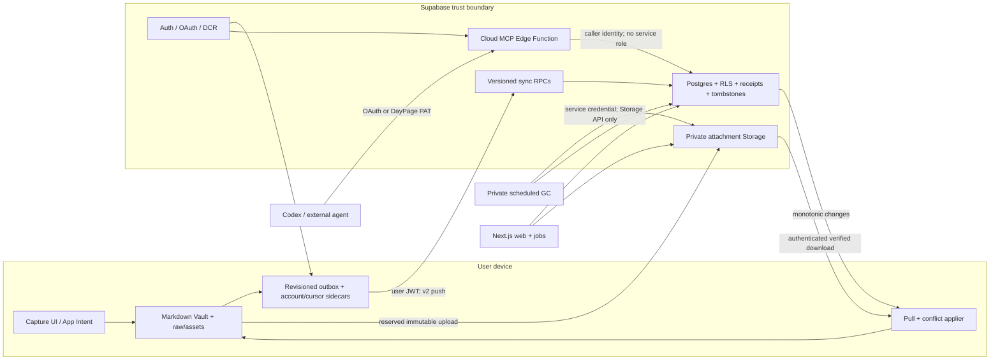

# DayPage backend system

This document is the current operating blueprint for DayPage's backend. It separates
implemented behavior from proposed work and production operations. Accepted decisions
remain authoritative when details conflict.

## Capability status

| Capability | Current state | Evidence / owner |
| --- | --- | --- |
| Email/Apple identity and session-backed native sync | Implemented | ADR-0008, `AuthService`, native live tests |
| Local-first memo create/edit/delete | Implemented | Vault + revisioned outbox + sync RPC |
| Multi-device incremental pull and conflicts | Implemented | server sequence cursor, two-Vault live test |
| Tenant isolation and operation idempotency | Implemented | RLS migrations and transactional negative verifier |
| External agent access | Implemented | OAuth/PAT, Streamable HTTP MCP, SDK acceptance |
| Local backend from an empty database | Implemented | pinned CLI, Edge bundle, Supabase + Drizzle migrations |
| Photo/audio/PDF byte sync | Implemented locally; staging pending | ADR-0016, v2 RPCs, two-Vault + TUS live tests |
| Delayed attachment deletion | Implemented locally; scheduler not deployed | 30-day queue + leased private Storage-API worker |
| Guaranteed iOS background execution | Not promised | foreground/process-lifetime sync by ADR-0008 |
| Production migration/deployment | Not authorized | staging evidence exists; production remains unchanged |

## Runtime topology



The Vault is the capture source of truth. Postgres is the authenticated cross-device
replica, query boundary, web data store, and agent-facing read/write surface. It does not
replace the local capture commit.

## Native write transaction

1. `RawStorage` atomically commits `vault/raw/YYYY-MM-DD.md` in the existing format.
2. The same mutation records an operation under `vault/_agent/sync/outbox-v1.json`.
3. UI success means local durability; network state is reported separately.
4. After session restoration, `SupabaseSyncUploader` sends the operation with the user's
   publishable key and access token.
5. For attachments, the client streams SHA-256/size from a safe `raw/assets/**` path,
   reserves the exact tenant/memo/content key, uploads without overwrite (TUS above
   6 MiB), and verifies any pre-existing object rather than trusting it.
6. `daypage_apply_sync_operations_v2` derives the tenant from `auth.uid()`, atomically
   commits the memo + ordered manifest + receipt, and binds the receipt to protocol,
   operation, memo, kind, revision, memo hash, and manifest hash.
7. The client removes only the exact acknowledged outbox operation. A timeout or lost
   response retries the same operation safely.

Cloud sync is provider-encrypted, not end-to-end encrypted. Markdown never contains an
account ID, object key, upload URL, credential, or transfer status.

## Pull, conflicts, and account safety

- Each user-visible memo mutation receives a server-owned `sync_change_sequence`.
- A device pulls changes strictly after its durable integer cursor.
- Before the memo cursor advances, each remote media obligation is persisted in the
  atomic transfer sidecar. Downloads are staged, streamed through SHA-256/size
  verification, and atomically installed under `raw/assets/`.
- Remote application bypasses outbound recording so a pull cannot echo into another
  push.
- A newer remote revision wins its UUID. If a local unsynced edit conflicts, DayPage
  preserves the local text under a new UUID instead of discarding it.
- A Vault binds to the first authenticated account that enables sync. Another account
  fails closed rather than uploading the old Vault under a new tenant.
- Tombstones converge deletion across devices without making wall clocks authoritative.

## Agent and integration path

The canonical MCP resource is the Supabase Edge function built from
`packages/mcp-server` with the official MCP SDK.

Interactive clients use Supabase OAuth 2.1/OIDC, PKCE, consent, and dynamic client
registration. The custom access-token hook adds the canonical MCP resource audience only
to OAuth-client sessions. DayPage read/write permission is separately rechecked from
`mcp_client_grants` on every request.

Non-interactive clients use a revocable DayPage PAT. Only its SHA-256 hash is stored.
The fixed `SECURITY DEFINER` RPC resolves owner and scopes internally; it never accepts a
caller-supplied user ID and exposes no underlying key table to the anonymous role.

Neither path puts a service-role key or `DATABASE_URL` in the request handler. MCP logs
exclude memo content and credentials.

## Environments

| Environment | Purpose | Rules |
| --- | --- | --- |
| Local | reproducible development and destructive synthetic verification | `pnpm backend:verify:local`; generated users/PATs are cleaned up |
| Staging | deployed OAuth/DCR, RLS and real-client acceptance | synthetic accounts/data only; evidence in the MCP runbook |
| Production | real user durability | no migration, deployment, key creation, or probe without explicit authorization |

The repository root `.env` is for app/hosted configuration. Local Supabase functions use
an ignored `supabase/functions/.env` generated from a credential-free example, so a
production project URL cannot be consumed accidentally by the local acceptance command.

## Failure and recovery contract

| Failure | Required behavior |
| --- | --- |
| Offline or signed out | Vault commit succeeds; outbox remains visible and pending |
| App/process termination | persisted outbox/cursor resumes after restoration |
| RPC timeout after commit | exact retry returns the historical receipt |
| Stale local revision | operation remains actionable; pull resolves and preserves conflict copy |
| Damaged/reused operation ID | immutable tuple mismatch is rejected |
| Account changed for a bound Vault | fail closed before installing uploader/puller |
| Pull page malformed or unordered | reject page; do not advance cursor |
| MCP token expired, wrong audience, revoked grant/PAT | fail with 401/403; no data query |
| Attachment upload/download failure | sidecar remains pending/failed; unrelated text push and pull continue |
| Cellular with default policy | memo metadata continues; media waits for Wi-Fi unless the user opts in |
| Existing immutable object | authenticated download + hash/size verification before reuse |
| Declared/actual upload mismatch | commit rejects it; inventory expires and queues it after 10 minutes |
| Memo deletion | manifest hidden immediately; objects queued for at least 30 days |
| Restore during grace | queue row is cancelled under a row lock; active object remains |
| GC interruption | lease expires and bounded worker retry resumes idempotently |

Rollback disables remote writers and MCP configuration first. It never deletes the
local Vault or silently acknowledges pending operations. Additive receipt/tombstone data
remains until separately reviewed cleanup.

## Security and operational gates

The minimum local gate is:

```bash
pnpm backend:verify:local
```

It must prove, against a running empty-capable local stack:

- both migration journals are applied;
- cross-user reads and writes fail under RLS;
- exact retry succeeds and operation-ID tuple reuse fails;
- stale revisions, tombstones, monotonic pull, and OAuth hook permissions behave as
  specified;
- a real native Vault/outbox mutation uploads and reads back;
- two independent Vaults converge JPEG/M4A order, metadata, playable bytes, restore,
  and delete;
- a real 7 MiB TUS upload resumes from the server offset after a forced interruption;
- unreserved, wrong-memo, and cross-tenant Storage writes fail;
- the private GC rejects anonymous calls and deletes due objects through the Storage API;
- MCP metadata/challenge are public and environment-correct;
- the official MCP SDK reads the native marker, writes a memo, and reads it back;
- synthetic Auth users, memos, grants, and PATs are cleaned up.

Promotion additionally requires focused package/type/contract tests, negative staging
RLS, deployed OAuth consent/revocation, real Codex access, latency evidence against the
ADR budgets, rollback rehearsal, and explicit production authorization.

## Current boundaries and promotion state

Issue [#884](https://github.com/getyak/daypage/issues/884) and
[ADR-0016](architecture/decisions/ADR-0016-revisioned-attachment-sync.md) is accepted.
The complete flow is implemented and proven against the empty-reset local stack.
Production remains untouched. Staging deployment, real-device background/cellular
rehearsal, and production migration still require separate authorization.

Related decisions and operations:

- [ADR-0008](architecture/decisions/ADR-0008-local-first-sync-and-cloud-mcp.md)
- [ADR-0009](architecture/decisions/ADR-0009-native-surfaces-shared-contracts.md)
- [Supabase Auth setup](supabase-auth-setup.md)
- [Cloud MCP staging runbook](mcp-cloud-runbook.md)
