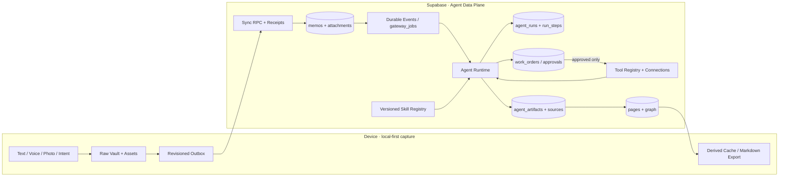
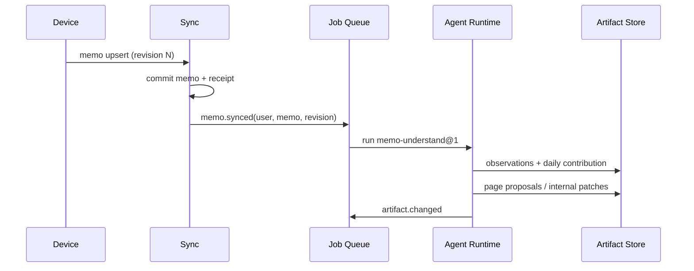

# DayPage Backend-first Agent Data Plane

> Agent、Skill、Automation、Tool 与派生存储架构设计稿

- **Status:** Accepted; implementation contract is ADR-0018
- **Date:** 2026-08-28
- **Scope:** 存储权威、逐条编译、日/周聚合、Agent Runtime、工具权限、运行回执、迁移
- **Architecture record:** [ADR-0018](../architecture/decisions/ADR-0018-backend-first-agent-data-plane.md)
- **Required follow-up:** 通过 [Issue #916](https://github.com/getyak/daypage/issues/916) 跟踪；生产迁移、backfill 与 rollout 仍需单独授权

## 0. 结论

DayPage 应采用 **local-first capture + backend-first intelligence**：

- Native 产生的原始 memo 和附件继续在设备本地先落盘，捕获不等待网络；
- Web/MCP 等远程入口在后端按同一 revision contract 提交，再同步到设备 Vault；
- Supabase 是跨设备协调、租户隔离、Web、Agent 与集成的统一数据面；
- Daily Page、实体、关系、embedding、Agent Run、Automation 和工具回执以后端为权威；
- 客户端可以缓存或导出派生 Markdown，但不再与后端维持两套可写编译真相；
- 每条 memo 立即执行有边界的理解 Skill，Daily/Weekly 是消费结构化产物的 reducer；
- 日历、邮件等外部写操作只生成提案，经过明确审批后才由 Tool Executor 执行。

核心心智：

> 每条记录进入后立即理解；每天形成叙事；每周形成判断；只有经过批准才进入外部世界。

## 1. 为什么现在要调整

### 1.1 已有能力

当前系统已经具备大部分基础设施：

- 原始 Vault、revisioned outbox、Supabase push/pull、tombstone 和冲突保留；
- Postgres RLS、operation receipt、Private Storage；
- Web 端按 `memo/created` 逐条运行的 Inngest compiler；
- Daily Page 与 Weekly Report 定时任务；
- `pages`、`page_sources`、`change_log`、`prompt_log`；
- `gateway_jobs`、`work_orders`、`agent_sessions`；
- OAuth/PAT 保护的 DayPage Cloud MCP。

### 1.2 当前问题

1. **派生数据有两套写入路径。** Native `CompilationService` 写 `vault/wiki`，Web compiler 写 Postgres `pages`，长期会发生语义和版本漂移。
2. **逐条 compiler 仍是硬编码流水线。** Prompt、解析、检索、写库和 webhook 在同一个函数中，没有可复用、可版本化的 Skill 边界。
3. **Agent 只是聊天人格。** 当前 Agent 主要由 persona、model、domain 和 top-k 构成，没有 Tool Policy、Skill Binding、Automation 或结构化输出契约。
4. **Daily/Weekly 是固定 cron。** Daily 固定 UTC 日期边界；Weekly 主要统计数量，尚未形成用户时区下可复用的复盘能力。
5. **运行状态过粗。** `memos.compile_status` 无法表达一次输入触发多个 Skill、部分产出成功、外部动作待批准等情况。
6. **并发页面更新可能覆盖。** 页面 `version` 会递增，但更新没有用预期旧版本做条件，两个 memo 同时修改同一页时仍可能 last-write-wins。
7. **工具权限不够结构化。** 通过 intent 文本分类审批可以作为提示，但不能成为邮件、日历、发布等真实副作用的授权边界。

## 2. 设计原则

### 2.1 原始内容与派生智能分离

- `raw` 是用户信源，必须可读、可导出、可离线写入；
- `derived` 是可重新计算但需要版本、来源和审计的智能产物；
- Agent 不直接改写用户原话；它创建 observation、artifact、page patch 或 action proposal；
- 所有派生结论必须能回到具体 memo/source span。

### 2.2 后端优先不等于云端唯一

后端优先指 **Agent 运行和派生状态以后端为统一权威**，不是取消本地捕获：

- 设备离线时仍能成功捕获；
- 网络恢复后通过既有 outbox 同步；
- Web/MCP 等远程捕获先在后端提交，再通过 pull 进入本地 Vault；
- Agent 在同步确认后处理后端记录；
- 客户端展示本地捕获状态与后端理解状态，两者不伪装成同一状态。

### 2.3 Agent 必须有边界

编译不是让一个自由行动的 Agent 随意决定一切，而是：

- 固定输入范围；
- 固定 Skill 版本；
- 明确 Tool allow-list；
- 结构化输出 schema；
- token、时长、工具调用数量预算；
- 内部写与外部写分级审批；
- 幂等、可重试、可回放。

### 2.4 Schedule 不是 Skill

- **Skill**：如何完成工作；
- **Automation**：什么时候、因为什么运行；
- **Agent**：以什么模型、策略、知识范围和预算运行；
- **Tool**：能读取或改变什么系统；
- **Run**：某一次真实执行；
- **Artifact**：执行后留下的可消费结果。

同一个 `weekly-review@2` 可以被手动触发、每周触发，也可以在七个 Daily Page 齐备后由事件触发。

## 3. 目标拓扑



### 3.1 数据权威矩阵

| 数据类型 | 写入权威 | 后端角色 | 客户端角色 |
| --- | --- | --- | --- |
| 原始 memo | Native 来源本地先提交；Web/MCP 来源后端先提交 | revisioned coordination、远程入口、Agent 输入 | Native 权威捕获、离线编辑、便携副本、冲突保留 |
| 原始附件 | Native 来源本地先提交；远程来源 Private Storage 先提交 | Private Storage replica / remote ingress | 本地原件、延迟上传/下载 |
| observation | 后端 | 权威结构化理解 | 展示、缓存 |
| Daily/Weekly/Page | 后端 | 权威派生产物与版本 | 展示、缓存、显式导出 Markdown |
| Agent/Skill binding | 后端 | 权威配置 | 编辑配置 |
| Automation | 后端 | 调度、去重、时区 | 开关与编辑 |
| Run/Step/Receipt | 后端 | 权威审计与恢复 | 进度、错误、解释 |
| Tool credential | 连接提供方/安全后端 | 只保存安全引用与 scope | 发起授权、撤销 |
| 外部动作 | 外部系统 | 执行前保存 proposal/approval/receipt | 审批与查看结果 |

## 4. 核心领域模型

### 4.1 Agent Definition

Agent 是运行策略，不保存某一次执行状态。

```ts
type AgentDefinition = {
  id: string;
  userId: string;
  name: string;
  instructions: string;
  modelPolicy: {
    preferredModel: string;
    fallbackModel?: string;
    reasoningEffort?: string;
  };
  knowledgeScope: {
    domainIds?: string[];
    recencyDays?: number;
    topK: number;
  };
  budgetPolicy: {
    maxInputTokens: number;
    maxOutputTokens: number;
    maxToolCalls: number;
    timeoutSeconds: number;
  };
};
```

Agent 不直接携带 OAuth token，也不直接保存 cron。

### 4.2 Skill Manifest

Skill 是可版本化的工作方法，由 instruction、schema 和可选执行代码组成。

```ts
type SkillManifest = {
  key: string;                 // memo-understand
  version: string;             // 1.0.0
  description: string;
  inputSchema: object;
  outputSchema: object;
  requiredTools: string[];
  optionalTools: string[];
  defaultRisk: "read" | "internal_write" | "external_write";
  implementationRef: string;   // checked-in handler / hosted skill ref
  checksum: string;
};
```

首批 Skill：

| Skill | 触发粒度 | 主要产物 |
| --- | --- | --- |
| `memo-understand@1` | 每条 memo | observation、entity、relation、task、daily contribution |
| `page-reconcile@1` | observation/page 变化 | page patch、links、conflicts |
| `daily-synthesize@1` | debounce + 日界线 | living/final Daily Page |
| `weekly-review@1` | 手动或每周 | trend、open loop、reflection、next-week proposal |
| `action-plan@1` | 用户请求或 review 产物 | work order proposals，不直接执行 |

### 4.3 Tool Definition 与 Connection

Tool Definition 描述能力和风险；Connection 描述某个用户是否已授权。

```ts
type ToolDefinition = {
  key: string;                 // calendar.create_event
  source: "builtin" | "daypage" | "mcp" | "connector" | "function";
  effect: "read" | "internal_write" | "external_write" | "destructive";
  inputSchema: object;
  outputSchema: object;
  defaultApproval: "auto" | "confirm" | "forbidden";
  requiredScopes: string[];
  timeoutSeconds: number;
  maxResultBytes: number;
};
```

推荐默认策略：

| Tool | Effect | 默认审批 |
| --- | --- | --- |
| `daypage.search` | read | auto |
| `daypage.get_memo` | read | auto |
| `daypage.write_artifact` | internal_write | auto + receipt |
| `calendar.list_events` | read | auto |
| `calendar.create_event` | external_write | confirm |
| `email.search` | read | auto |
| `email.create_draft` | external_write | confirm 或 draft-only auto |
| `email.send` | external_write | confirm |
| 删除、支付、公开发布 | destructive/external_write | confirm 或 forbidden |

审批必须由 Tool Definition、用户 policy 与连接 scope 共同决定。Intent 文本分类只能提高 UX，不能授权执行。

### 4.4 Automation

Automation 把 Trigger、Agent 和 Skill 绑定起来。

```ts
type Automation = {
  id: string;
  userId: string;
  name: string;
  trigger: EventTrigger | ScheduleTrigger | ManualTrigger;
  timezone: string;
  agentId: string;
  skillVersionId: string;
  inputSelector: object;
  coalescePolicy: {
    debounceSeconds?: number;
    lockKeyTemplate: string;
  };
  enabled: boolean;
};
```

示例：

```yaml
name: Monday review
trigger:
  type: schedule
  local_time: "09:00"
  weekdays: [monday]
timezone: Asia/Shanghai
agent: reflection-agent
skill: weekly-review@1.0.0
tools:
  - daypage.search
  - daypage.get_page
  - calendar.list_events
```

### 4.5 Run、Step、Artifact 与 Proposal

- **Agent Run** 保存一次运行使用的 Agent/Skill/Tool Policy 快照；后续配置变化不能改变历史解释。
- **Run Step** 保存阶段状态、耗时、token、tool receipt 和错误。
- **Artifact** 保存结构化产出，带 schema version、来源和生命周期。
- **Work Order** 保存需要审批或交给 executor 的具体动作。

## 5. 统一输出契约

Agent 不应只返回一段 Markdown。所有 Skill 使用统一 envelope，内容再由各自 schema 细化。

```json
{
  "run_id": "run_uuid",
  "status": "completed",
  "summary": "从 memo 中提取了一个项目进展、一个待办和一个日历建议。",
  "observations": [
    {
      "kind": "fact",
      "subject": "DayPage backend migration",
      "predicate": "status",
      "value": "designing",
      "confidence": 0.94,
      "source_refs": [
        { "memo_id": "memo_uuid", "start": 0, "end": 22 }
      ]
    }
  ],
  "artifacts": [
    {
      "kind": "daily_contribution",
      "schema_version": 1,
      "payload": {
        "headline": "明确 backend-first intelligence 方向",
        "open_loops": ["完成 ADR 评审"]
      }
    }
  ],
  "proposed_actions": [
    {
      "tool": "calendar.create_event",
      "arguments": {
        "title": "DayPage architecture review"
      },
      "effect": "external_write",
      "approval": "required"
    }
  ],
  "receipts": [
    {
      "step": "extract",
      "status": "completed",
      "input_hash": "sha256:...",
      "output_hash": "sha256:...",
      "tokens_in": 812,
      "tokens_out": 284,
      "duration_ms": 1340
    }
  ]
}
```

### 5.1 Observation 规则

- 用户原话与模型推断必须分开；
- 每个事实、关系、待办、冲突都带 source ref；
- confidence 只表达模型确信度，不替代 provenance；
- observation 可以失效或被新 observation supersede，不直接覆盖历史事实；
- 页面是 observation 的人类可读 materialized view，不是唯一证据容器。

### 5.2 Artifact 生命周期

```text
draft -> live -> superseded -> archived
          \-> needs_review
```

- memo 级 enrichment 默认 `live`，因为只在内部可见且可重算；
- 页面 patch 若发生版本冲突进入 `needs_review` 或重新规划；
- 外部动作永远不是 Artifact 自动执行，而是 Proposal/Work Order。

## 6. 逐条编译与聚合设计

### 6.1 Memo understanding



幂等键：

```text
user_id : memo_id : accepted_revision : skill_checksum
```

同一内容、同一 Skill 版本只产生一个成功 Run。显式重跑创建新的 attempt，但仍关联同一 logical operation。

### 6.2 Daily Page

Daily Page 不应每收到一条 memo 就全文重写。

采用两阶段 reducer：

1. **Living Daily Page**：新 contribution 到达后按用户和本地日期 coalesce，建议 debounce 2–5 分钟；
2. **Finalized Daily Page**：用户本地日界线后延迟封版，例如次日 04:00；
3. **Late arrival**：迟到 memo 使该日生成新 revision，不静默修改旧 revision；UI 标记“已补充”；
4. **Manual perspective**：同一 source set 可以生成独立 perspective artifact，不覆盖 canonical Daily Page。

日期必须由用户 IANA timezone 计算，不能用统一 UTC 日期切片。

### 6.3 Weekly Review

Weekly Review 消费：

- 七天 Daily Page artifacts；
- open loops / tasks / contradictions；
- 本周新增或显著变化的 entities/pages；
- 可选的只读日历上下文；
- 上周 proposal 的完成/忽略结果。

输出：

- 本周叙事；
- 变化与趋势；
- 未完成事项；
- 值得回看的孤峰；
- 反思问题；
- 下周行动 proposals。

它不直接发送邮件或创建日历事件。

## 7. 并发、幂等与一致性

### 7.1 页面写入

所有更新必须携带 `expected_version`：

```sql
update pages
set body_md = $body, version = version + 1
where id = $id and version = $expected_version;
```

更新行数为 0 时：

1. 重新读取最新页面；
2. 判断当前 observation 是否已被包含；
3. 已包含则标记 idempotent success；
4. 未包含则重新规划 patch；
5. 超过有限次数进入 `needs_review`，禁止盲目覆盖。

### 7.2 Reducer 锁

建议 lock key：

```text
daily:{user_id}:{local_date}
weekly:{user_id}:{iso_week}:{timezone}
page:{user_id}:{page_id}
```

`gateway_jobs` 负责 durable queue、attempt 和 lease；不要在应用进程内依赖 mutex。

### 7.3 副作用 outbox

内部数据库 transaction 与外部 Tool 调用不能假装成一个原子事务：

1. 保存 approved work order；
2. 写 tool-execution outbox；
3. executor 领取 lease；
4. 使用 provider idempotency key 执行；
5. 保存 provider receipt；
6. 更新 work order；
7. 超时只重试可证明幂等的动作。

## 8. 后端数据模型

### 8.1 复用现有表

| 现有表 | 新职责 |
| --- | --- |
| `memos` | 原始同步记录；不再承载全部运行状态 |
| `pages` | 人类可读 materialized artifacts |
| `page_sources` | 页面与 memo 的基础来源关系 |
| `change_log` | 内部 mutation receipt |
| `prompt_log` | 模型调用成本与供应商日志 |
| `gateway_jobs` | durable trigger、lease、retry、coalesce |
| `work_orders` | 外部动作 proposal、审批和 executor handoff |
| `agent_sessions` | 长运行 executor session；不替代单次 run |
| `agents` | 扩展为 Agent Definition |

### 8.2 建议新增表

| 表 | 关键字段 |
| --- | --- |
| `skill_versions` | key、version、manifest、schemas、checksum、status |
| `agent_skill_bindings` | agent、skill version、enabled、priority |
| `tool_connections` | user、provider、auth_ref、scopes、status |
| `agent_tool_bindings` | agent、tool、connection、approval override |
| `automations` | trigger、timezone、agent、skill、selector、coalesce、enabled |
| `agent_runs` | trigger snapshot、agent snapshot、skill checksum、idempotency、status、budget、error |
| `agent_run_steps` | run、step、tool、status、hash、tokens、duration、receipt |
| `agent_artifacts` | run、kind、schema version、payload、body_md、status、revision |
| `artifact_sources` | artifact、memo/page、source span、provenance、weight |

不建议第一版为每一种 Artifact 建独立表。先用带强 schema version 的 `agent_artifacts`，对查询量高且稳定的类型再物化专用表或 view。

### 8.3 `memos.compile_status` 的退场

迁移期继续维护 `compile_status` 作为兼容摘要，但真实状态来自 Run：

```text
captured -> synced -> understanding -> understood
                             \-> needs_attention
```

一个 memo 可以同时有：

- `memo-understand` 已完成；
- `page-reconcile` 冲突待处理；
- `daily-synthesize` 等待 debounce；
- 一个 calendar proposal 等待批准。

这些状态不能被一个 enum 无损表达。

## 9. API 与事件契约

### 9.1 内部事件

```text
memo.synced
memo.deleted
agent.run.requested
agent.run.completed
agent.run.failed
artifact.changed
automation.due
action.approved
action.rejected
tool.execution.requested
tool.execution.completed
```

事件 payload 只携带 identifier、accepted revision 和 routing metadata；正文由 worker 在 RLS/服务边界内读取，避免复制敏感数据。

### 9.2 产品 API

```text
POST /api/agent-runs
GET  /api/agent-runs/:id
GET  /api/memos/:id/runs
GET  /api/artifacts/:id
GET  /api/automations
POST /api/automations
PATCH /api/automations/:id
POST /api/work-orders/:id/approve
POST /api/work-orders/:id/reject
```

所有 user-facing API 从 session/user token 推导 tenant，不接受调用者自报 `user_id`。

## 10. 产品界面设计

### 10.1 Memo 状态

用户看到的是可信的阶段，而不是内部函数名：

- 已保存在此设备；
- 等待登录/同步；
- 已同步；
- 正在理解；
- 已整理；
- 需要处理。

### 10.2 Run Detail

每次 Agent Run 提供五个区域：

1. **结果摘要**：这次处理了什么；
2. **来源**：引用哪些 memo 片段；
3. **产生的内容**：observation、页面与关系；
4. **建议动作**：等待批准、已拒绝或已执行；
5. **运行回执**：步骤、工具、耗时、token、错误与重试。

默认界面只显示前三项；回执放在可展开的高级区域。

### 10.3 Automation Editor

配置顺序应符合用户心智：

```text
什么时候运行
  -> 用哪个能力
  -> 可以读取什么
  -> 可以做什么
  -> 哪些动作需要确认
  -> 结果放在哪里 / 如何通知
```

不要让用户直接编辑 raw cron 或 MCP tool name；UI 使用“每周一上午九点”“允许读取日历”“发送邮件前总是确认”等语义化配置。

## 11. 安全与隐私

1. 所有数据访问继续受 `auth.uid()` / RLS 约束；
2. Agent Run 保存 connection ID 和 tool key，不保存 OAuth token；
3. Tool Result 进入模型前执行大小限制、字段 allow-list 和敏感字段清理；
4. 邮件、日历等连接遵循最小 OAuth scope；
5. 外部写默认 confirm，未知工具默认 forbidden；
6. Run log 不保存完整 memo 正文，只保存 source refs、hash 和必要摘要；
7. Prompt 调试采样必须显式开关、脱敏、有保留期；
8. Tool instructions 和 MCP 返回内容视为不可信输入，不能提高自身权限；
9. 用户撤销连接后，新 Run 立即不可调用，等待中的 Work Order 不保留隐式授权；
10. 删除账户或 Vault 解绑需要单独的数据保留与导出流程。

## 12. 迁移计划

### Phase 0 · 决策与基线

- 建立 GitHub issue；
- 写并接受新的 ADR，明确本文与 ADR-0008/0010 的关系；
- 记录当前 native/web compiler 输出、成本、延迟和失败率；
- 定义 synthetic backfill fixtures。

### Phase 1 · 可观测运行层

- 新增 Skill、Automation、Run、Step、Artifact 表；
- 当前 Web compiler 仍保持行为，只把步骤镜像为 Run/Receipt；
- 不改变任何用户输出；
- 补齐当前 `compile_step` 未更新的问题或让 UI 改读 Run。

### Phase 2 · 提取首个 Skill

- 将 compile prompt、parser 和 apply plan 提取为 `memo-understand@1`；
- 使用结构化 output schema；
- 同一 memo 在旧 compiler 与新 Skill 中 shadow-run；
- 新产物只写 shadow artifact，不修改页面。

### Phase 3 · 后端逐条理解成为主路径

- 开启 observation 和 daily contribution 写入；
- page reconcile 使用 optimistic concurrency；
- 保留 feature flag 回到旧 Web compiler；
- Native compiler 暂不关闭，但不让两条路径写同一后端页面。

### Phase 4 · Daily/Weekly Reducer

- 引入用户 timezone；
- living Daily Page + finalization + late-arrival revision；
- Weekly Review 消费 artifacts；
- 移除固定 UTC 日期假设。

### Phase 5 · 客户端收敛

- Native 客户端读取后端 derived artifacts；
- 本地 `vault/wiki` 转为显式缓存/导出；
- feature flag 关闭 Native CompilationService 新写入；
- 旧 Markdown 不删除、不静默覆盖。

### Phase 6 · Tool 与外部动作

- 先接只读工具；
- 再接 draft-only；
- 最后接审批后的外部写；
- 每个 connector 独立做 revoke、scope、idempotency 和 receipt 验收。

### Phase 7 · Production rollout

- Local -> staging -> 小比例 opt-in -> 扩大；
- backfill 先 dry-run，再按用户分批；
- 校验 memo/attachment 数量、hash、revision、RLS 和 artifact provenance；
- Production migration、deployment 和真实用户 backfill 必须单独授权。

## 13. 回滚设计

- 关闭 Automation 不删除 Run、Artifact 或 outbox；
- 关闭新 compiler 后，新 memo 可回到旧 Web compiler；
- 客户端保留原始 Vault，不依赖后端回滚才能读取用户原文；
- shadow artifact 可按 run/skill version 隔离，不污染 canonical pages；
- 页面写入保留 change log 和 revision，可生成补偿 patch，禁止直接 destructive rollback；
- 外部 Tool 已成功执行时不能声称数据库回滚等于世界回滚，必须展示真实 receipt 与补偿选项。

## 14. 验收标准

### 数据安全

- 离线捕获成功且不会被 Agent 依赖阻塞；
- exact retry 不产生重复 observation、page source 或外部动作；
- 跨用户读取、Run、Artifact、Tool Connection 全部被 RLS 拒绝；
- backfill 前后 raw memo 与附件 hash 完全一致；
- 无迁移步骤删除或重写用户 Vault。

### 正确性

- 同一 memo/revision/skill checksum 只有一个 canonical successful run；
- 两条 memo 并发更新同一页面不发生静默覆盖；
- Daily Page 使用用户本地日期；
- Late arrival 产生可解释的新 revision；
- 每个派生事实可回到 source memo/span；
- 外部写在无批准时调用次数为 0。

### 体验

- 捕获确认仍满足既有本地 p95 预算；
- 新 memo 的理解状态可恢复、可重试，不会永久卡在模糊的 pending；
- Run Detail 能回答“用了什么、改了什么、为什么、是否执行了外部动作”；
- 用户能单独关闭 Daily、Weekly 或某个外部工具，而不关闭基础捕获。

### 成本与运行

- 每个 Skill 有 token、tool call、timeout 预算；
- Daily reducer 能 coalesce 高频 memo，不按 memo 全量重写；
- Weekly 不重新读取全部原始历史，只读取 bounded artifacts 和必要来源；
- 失败重试不会重复支付已 memoized 的昂贵步骤。

## 15. 需要评审的开放问题

1. 后端派生数据采用当前 provider encryption 是否满足目标用户，还是需要为 Agent Artifact 单独设计 E2EE/本地模式？
2. `vault/wiki` 未来是自动同步缓存、用户显式导出，还是两种模式都支持？
3. 历史 backfill 默认处理多少年，是否按最近使用/搜索热度分层？
4. Living Daily Page 的 debounce 与 finalization 时间是否允许用户配置？
5. observation 通用 JSONB 何时升级成专用 temporal fact schema？
6. on-device 小模型是否作为隐私模式或离线 enrichment fallback？
7. 邮件 draft 是否允许自动创建，还是所有外部系统写入统一 confirm？
8. 用户自定义 Skill 是仅指令/schema，还是允许上传脚本；若允许，沙箱与供应链策略是什么？

## 16. 推荐决策

建议评审先接受以下最小集合：

1. 接受 **local-first capture + backend-first intelligence**；
2. 接受后端为所有派生数据、Agent Run 和 Automation 的权威运行面；
3. 接受逐条理解 + Daily/Weekly reducer，而不是互相替代；
4. 接受 Agent、Skill、Tool、Automation、Run、Artifact 的独立模型；
5. 接受统一结构化输出 envelope 与 source-level provenance；
6. 接受外部写 proposal-first、tool-policy 授权和 execution receipt；
7. 接受 shadow-run、feature flag、非破坏 backfill 和可回滚分阶段迁移。

这七项已由 ADR-0018 接受。实现保持 additive migration、shadow-first 和
feature flag；生产迁移、backfill 与关闭旧路径仍是独立的运维决策。

## 17. 相关当前文档

- [ADR-0008: Local-first sync and user-scoped DayPage Cloud MCP](../architecture/decisions/ADR-0008-local-first-sync-and-cloud-mcp.md)
- [ADR-0010: Asynchronous derived read models for the Markdown Vault](../architecture/decisions/ADR-0010-vault-derived-read-models.md)
- [ADR-0018: Backend-first Agent data plane with local-first capture](../architecture/decisions/ADR-0018-backend-first-agent-data-plane.md)
- [Backend system](../backend-system.md)
- [Current architecture](../architecture/overview.md)
